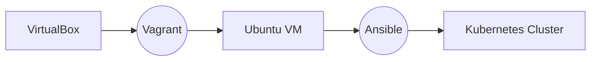

# Kubernetes Cluster
Kubernetes Infrastructure-as-Code (IaC) for the local deployment of a Kubernetes (k8s) cluster.

## Description
This repository contains files to locally deploy a Kubernetes cluster via VirtualBox, Vagrant and Ansible. It is tested on Windows 10, but also should work on other versions and operating systems that are compatible with VirtualBox and Vagrant.

## Architecture



## Prerequirements

### Minimum System Requirements
| Resource | Quantity  |
|--|--|
| vCPUs | 4 |
| RAM | 4 GB |
| Disk Space | 64 GB |

### Software Requirements
| Software | Latest tested Version |
|--|--|
| Vagrant | 2.2.14 |
| VirtualBox | 6.1.16 r140961 |

## How To
1. Install Virtual Box or any other paravirtualization tool compatible with [bento/ubuntu-20.04]( https://app.vagrantup.com/bento/boxes/ubuntu-20.04 )
2. Install Vagrant
3. Open a shell and `cd` into this project
```
$ cd /path/to/Vagrantfile
```
4. execute `vagrant up` (this can take 15min-20min to finish)
```
$ vagrant up
```
5. connect to the Kubernetes Master node via `vagrant ssh k8s-master` and type `kubectl get nodes`. The output should look like this:
```
$ vagrant ssh k8s-master
vagrant@k8s-master:~$ kubectl get nodes
NAME           STATUS   ROLES                  AGE     VERSION
k8s-master     Ready    control-plane,master   27m     v1.19.6
k8s-worker-1   Ready    <none>                 7m48s   v1.19.6
```


> If you want more than one worker node and your system has the required resources, adjust the parameter `NODE_COUNT` in the `Vagrantfile` acordingly.

> On Windows you can use the command-line installer [Scoop]( https://scoop.sh ) to install all the required components.

 

### Latest tested Components

| Component | Version  |
|--|--|
| Ansible | 2.10.4 |
| Calico| 3.17|
| Docker |  19.03.13|
| kubectl | v1.21.2 |
| Kubernetes | v1.19.13 |
| Python | 2.7.18 |
| Ubunutu | 20.04 |
| Vagrant | 2.2.16 |
| VirtualBox | 6.1.16 r140961 |
| Windows | Windows 10 Build 19043.1110 |


## Known issues
| Topic | Description  | Workaround | Related Articles  |
|--|--|--|--|
| Focal (20.04 (LTS)) missing in Ubuntu ppa | Ansible can't be installed via apt because no release file does exist. | Use pip install | [Ansible#68645]( https://github.com/ansible/ansible/issues/68645 ) |
| Vagrant was unable to mount VirtualBox shared folders | Mounting of shared filesystem for VM on Host OS fails.  | Use an image that is compatible with your VirtualBox version | [Vagrant#11506]( https://github.com/hashicorp/vagrant/issues/11506 ) |
| Gpg key for docker repo fail to fetch from key server | Fails to fetch gpg key for docker installation.  | Use "deb [arch=amd64] https://download.docker.com/linux/ubuntu $(lsb_release -cs) stable" | [Moby#20022]( https://github.com/moby/moby/issues/20022 ) |
| Playbook does not exist on the guest| Ansible playbook throwing 'playbook does not exist on the guest' when testing with Vagrant machine | Use 'config.vm.synced_folder ".", "/vagrant"' in vagrant file | [vm.synced_folder]( https://www.vagrantup.com/docs/synced-folders/basic_usage.html ) |
| AMD-V is not enabled in VirtualBox on AMD APU | Issue that occurs with AMD CPUs and indicates that the virtualization for the CPU is not enabled | * Disable Hyper-VM <br> * Go into BIOS and enable CPU virtualization | [Askubuntu#118006]( https://askubuntu.com/questions/118006/amd-v-is-not-enabled-in-virtualbox-on-amd-apu ) |


## Further Readings
* [Ansible_Local]( https://www.vagrantup.com/docs/provisioning/ansible_local )
* [Chef Bento]( https://github.com/chef/bento )
* [Containerd.io]( https://containerd.io )
* [Project Calico]( https://www.projectcalico.org )
* [Install Docker Engine on Ubuntu]( https://docs.docker.com/engine/install/ubuntu/ )
* [Kubernetes Setup Using Ansible and Vagrant]( https://kubernetes.io/blog/2019/03/15/kubernetes-setup-using-ansible-and-vagrant/ )
* [Vagrant Tutorial]( https://learn.hashicorp.com/collections/vagrant/getting-started )
* [Vagrant Cloud]( https://app.vagrantup.com/boxes/search?order=desc&page=7&provider=virtualbox&sort=updated )


## Key Words
* Infrastructure-as-Code (IaC)
* Kubernetes
* Local
* Docker
* Ansible
* Vagrant
* VirtualBox

## ToDo
* Autmatically copy Kubernetes context file from k8s-master VM to Host machine. I.e. scp /etc/kubernetes/admin.conf 10.0.2.2:/C/Users/MyUser/.kube/config

## Author
Andreas Biberacher < bibatdevelopment@gmail.com >

Feel free to open discussions and pull requests :nerd_face:
